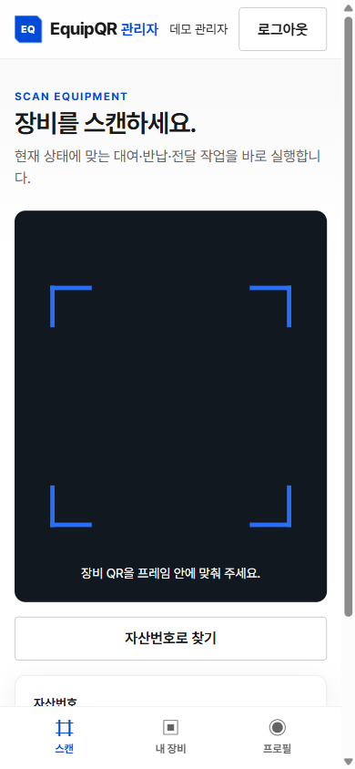
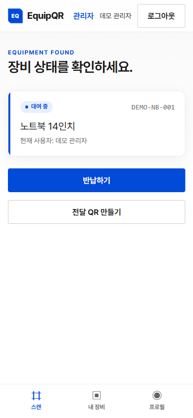
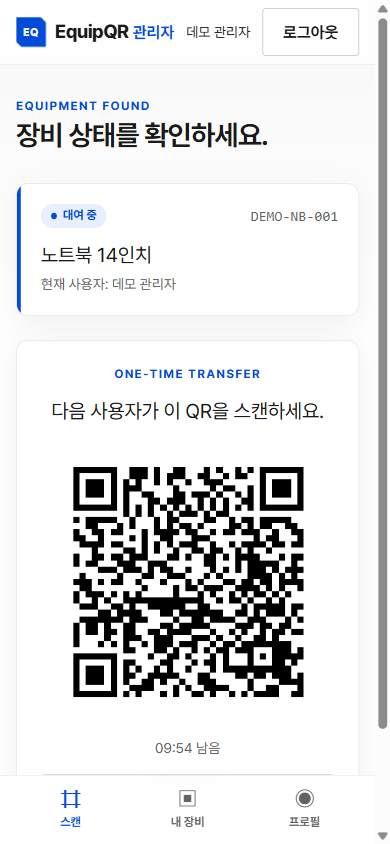
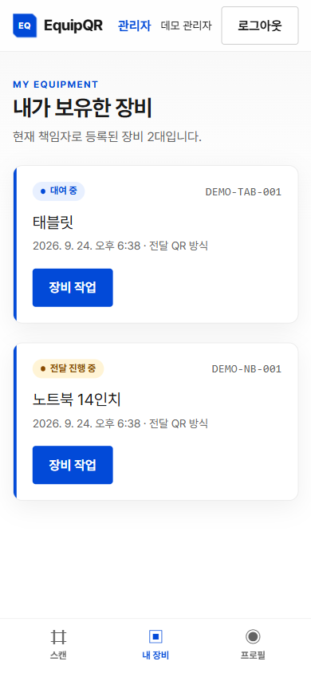
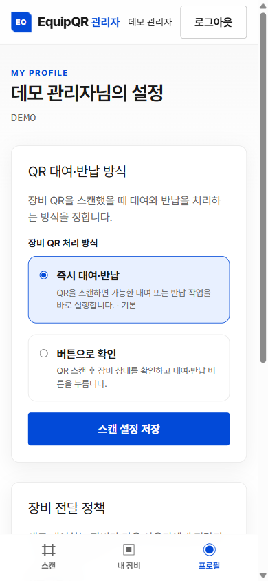
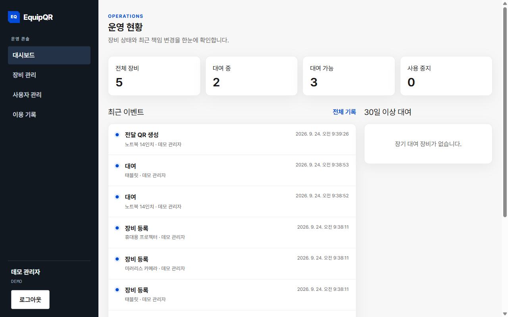
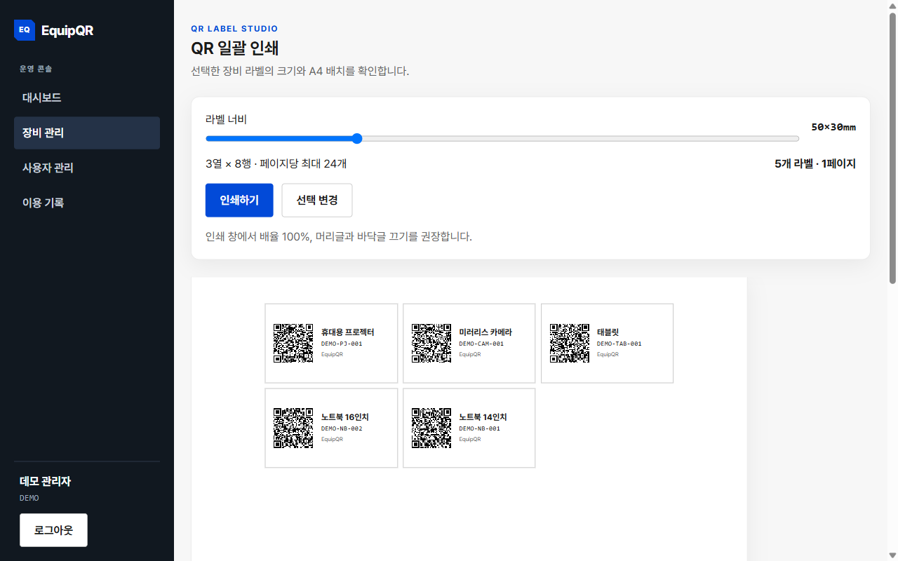

<div align="center">

# 🏷️ EquipQR

**Track who holds each piece of equipment and hand it over with a QR scan**

[](https://www.typescriptlang.org/)
[](https://nextjs.org/)
[](https://react.dev/)
[](https://www.postgresql.org/)
[](https://www.prisma.io/)
[](https://www.docker.com/)

**English** | [한국어](./README.ko.md)

</div>

---

## 💭 Developer's Note

> *<!-- TODO: one-line quote -->*

<!-- TODO: 개발 동기 -->

---

## ✨ Features

### 📷 QR Checkout and Return
- Each piece of equipment has a static QR code that links to `/scan/equipment/{publicCode}`. The public code is a random 24-byte base64url string, separate from the asset number
- Scanning shows the item's current status and offers checkout or return. Users can also type the asset number
- Checkout and return run in PostgreSQL `Serializable` transactions. A partial unique index allows only one active assignment per item
- Profile setting picks what a scan does: run the action immediately, or ask for confirmation first

### 🔁 Handover Between Users
- **Transfer QR (default)**: the current holder issues a one-time QR that expires after 10 minutes. The recipient scans it to accept. Only the token's SHA-256 hash is stored
- **Instant equipment QR (optional)**: anyone who scans the equipment QR takes it over directly, with no transfer QR needed
- The holder's transfer mode is copied into the assignment when they take the item, so later profile changes do not affect items they already hold
- After an instant transfer, both users get an in-app notification. The client polls `/api/notifications` every 10 seconds
- After an instant transfer, the previous holder still sees the item under "전달한 장비" (Transferred) in My Equipment until it is returned or comes back to them

### 🛠️ Admin Console
- Dashboard with counts of available, checked-out and out-of-service items, recent events, loans older than 30 days, and the top 10 users by items held
- Create users, switch them between active and inactive, and reset passwords (12 characters minimum)
- Register equipment, edit its details, set it in or out of service, and reassign or recall it with a required reason
- Paginated history of audit events (checkout, return, transfer, admin actions), searchable by equipment or user

### 🖨️ QR Label Printing
- Select equipment and print labels in bulk on A4
- Label width is adjustable from 40 to 80 mm. Height follows at 60% of the width (minimum 24 mm)
- Labels per page are calculated from the A4 printable area (190 × 277 mm) with a 2 mm gap

### 🔐 Authentication and Operations
- Login with employee number and password. Passwords are hashed with Argon2id (`@node-rs/argon2`)
- Sessions are random tokens stored as SHA-256 hashes in the DB and sent as an `httpOnly` cookie. They expire after 12 hours
- In-memory login rate limit: 10 attempts per account + IP and 200 per IP, within 15 minutes
- `/api/health/live` checks that the process is up. `/api/health/ready` checks the DB connection and that an active admin exists

---

## 🚀 Getting Started

### Prerequisites
- [Docker](https://www.docker.com/) with Compose
- No external API keys are required. A [Cloudflare Tunnel](https://developers.cloudflare.com/cloudflare-one/connections/connect-networks/) token is only needed for the production setup

### Installation

```bash
# Clone repository
git clone https://github.com/Zanviq/EquipQR.git
cd EquipQR

# Environment variables (defaults work for local use)
cp .env.example .env

# Build and run: db → migrate (migrations + demo seed) → web
docker compose up --build
```

Open `http://localhost:3000`. The `migrate` service applies Prisma migrations, then seeds demo data when `SEED_DEMO=true` (default). The seed skips anything that already exists, so restarts do not duplicate data.

Browsers only allow camera access over HTTPS, so on `localhost` use asset number entry instead of the camera.

### Demo Account

| Employee number | Password | Role |
|---|---|---|
| `demo` | `demo1234` | Admin |

The seed also registers 5 demo items (`DEMO-NB-001`, `DEMO-NB-002`, `DEMO-TAB-001`, `DEMO-CAM-001`, `DEMO-PJ-001`). The demo account is admin, so it can use both the employee screens and the admin console.

### Local Development

Requires Node.js 24. With the `db` service running (`docker compose up -d db`):

```bash
npm ci
npm run prisma:generate
npx prisma migrate deploy
npm run dev
```

### Deployment

For production (Docker Compose + Cloudflare Tunnel), backup and restore, see [DEPLOYMENT.md](./DEPLOYMENT.md) (Korean).

---

## 🛠️ Tech Stack

| Category | Technology |
|----------|------------|
| **Framework** | Next.js 16 (App Router), React 19, TypeScript |
| **Database** | PostgreSQL 18, Prisma 7 (`@prisma/adapter-pg`) |
| **Auth** | Argon2id (`@node-rs/argon2`), DB-backed session cookie |
| **QR** | `@zxing/browser` (scan), `qrcode` (generate) |
| **Validation** | Zod 4 |
| **Styling** | Tailwind CSS 4, Pretendard |
| **Testing** | Vitest, Testing Library |
| **Infra** | Docker Compose, Cloudflare Tunnel |

---

## 📁 Project Structure

```
EquipQR/
├── 📂 prisma/
│   ├── schema.prisma             # Users, sessions, equipment, assignments, transfer tickets, audit events
│   └── 📂 migrations/            # SQL migrations (incl. one-active-assignment partial index)
├── 📂 scripts/
│   ├── create-initial-admin.ts   # First admin bootstrap
│   ├── seed-demo.ts              # Demo account and equipment seed
│   ├── backup-db.sh              # pg_dump backup with checksum
│   └── restore-db.sh             # Verified restore
├── 📂 src/
│   ├── 📂 app/
│   │   ├── 📂 (auth)/login/      # Login page
│   │   ├── 📂 (employee)/        # Scan, my equipment, profile, transfer accept
│   │   ├── 📂 admin/             # Dashboard, users, equipment, history, label print
│   │   └── 📂 api/               # Route handlers (auth, equipment, transfer, admin, health)
│   ├── 📂 components/            # UI components (scanner, passport, notifications, print)
│   ├── 📂 server/
│   │   ├── 📂 auth/              # Password hashing, sessions, current user
│   │   ├── 📂 circulation/       # Checkout and return
│   │   ├── 📂 transfer/          # Transfer tickets, instant transfer
│   │   ├── 📂 admin/             # Admin operations and dashboard
│   │   └── 📂 http/              # Rate limit, response helpers, schemas
│   ├── 📂 lib/                   # Print layout, safe redirects, shared helpers
│   └── proxy.ts                  # Redirects employee routes to /login without a session
├── Dockerfile                    # Multi-stage build (deps → builder → migrator → runner)
├── compose.yaml                  # Local: db, migrate (+ demo seed), web
└── compose.production.yaml       # Production: db, migrate, web, tunnel
```

---

## 💡 How to Use

The UI is in Korean. Menu names are shown in parentheses.

1. **Register Equipment**: In Admin → Equipment (장비 관리), add an item with its asset number and name
2. **Print Labels**: Select items, click **선택한 QR 인쇄**, adjust the label width, and print on A4
3. **Check Out**: On **Scan (스캔)**, scan the equipment QR or enter the asset number, then click **대여하기**
4. **Hand Over**: In **My Equipment (내 장비)**, open an item and click **전달 QR 만들기**. The recipient scans it within 10 minutes. The holder can cancel it with **전달 QR 취소**
5. **Return**: Scan the equipment QR again and click **반납하기**
6. **Change Settings**: In **Profile (프로필)**, choose the transfer policy (transfer QR or instant) and the scan action (immediate or confirm)
7. **Review History**: In Admin → History (이용 기록), search events by equipment name, asset number, user name or employee number

---

## 🎨 Screenshots

<div align="center">

**Employee (mobile)**

<table>
  <tr>
    <td></td>
    <td></td>
    <td></td>
    <td></td>
    <td></td>
  </tr>
</table>

**Admin console**

<table>
  <tr>
    <td></td>
    <td></td>
  </tr>
</table>
</div>

---

## 📝 License

<!-- TODO: No LICENSE file in the repository yet. Choose a license and add it. -->

---

<div align="center">

| 👤 **Developer** | ✉️ **Email** |
|:---:|:---:|
| Zanviq | zanviq.dev@gmail.com |

</div>
